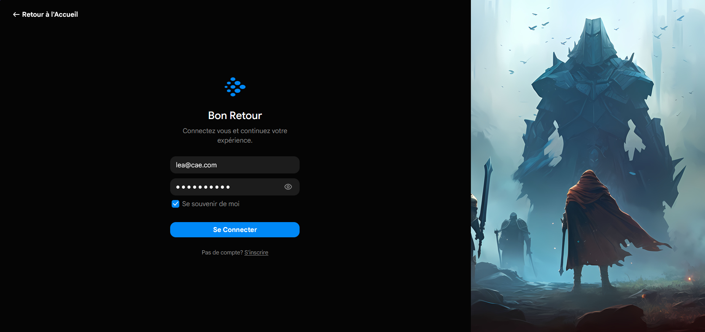
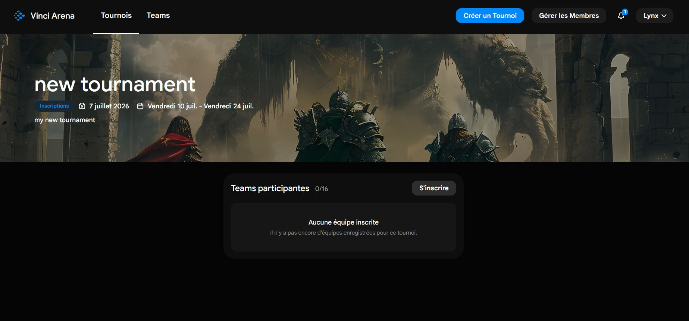
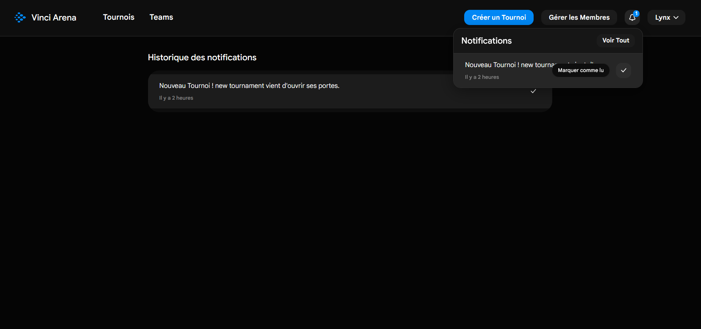
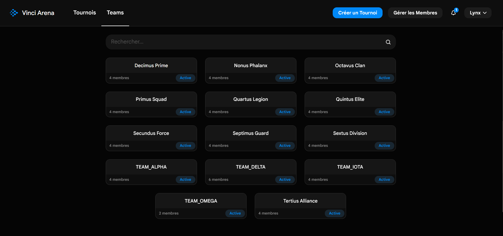
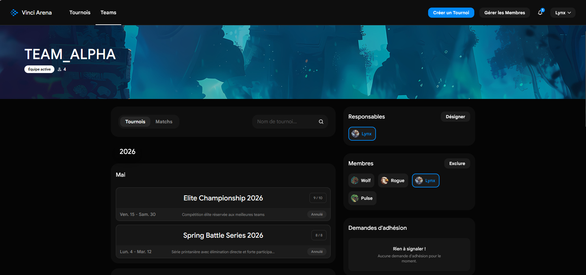

# 🏆 Tournament Manager

A full-stack tournament management platform for organizing competitive events. Create and manage tournaments, form teams, schedule matches, track results, and coordinate members — all through a modern, dark-themed web interface.

---

## Table of Contents

- [Overview](#overview)
- [Features](#features)
- [Tech Stack](#tech-stack)
- [Repository Structure](#repository-structure)
- [Getting Started](#getting-started)
- [Running the Full Stack](#running-the-full-stack)
- [Testing](#testing)
- [CI/CD](#cicd)
- [License](#license)

---

##  Mini Interface Preview

###  Authentication & Main Dashboard
| Login Interface | Tournaments Feed |
| --- | --- |
|  |  |
| *Gamer aesthetic login page (`login.png`)* | *Overview of upcoming, active, and past events (`main-page.png`)* |

###  Administrative & Management Modals
| Member Permissions Management | Tournament Creation Wizard |
| --- | --- |
|  |  |
| *Promote, moderate, or ban members globally (`member-management.png`)* | *Configuring dates, deadlines, and capacities (`create-tournamment-a.png`)* |

###  Tournament Hub & Notifications
| Live Tournament Portal | Real-Time Notification Center |
| --- | --- |
|  |  |
| *Dedicated page with hero banner and rosters (`Screenshot 2026-06-30 151049.jpg`)* | *Global event updates and tracking headers (`Screenshot 2026-06-30 151111.png`)* |

###  Team Directories & Profiles
| Team Discovery Grid | Team Showcase Panel | User Profile & Availability |
| --- | --- | --- |
|  |  |  |
| *Card layout showcasing all groups (`teams.png`)* | *Roster curation and join applications (`team.jpg`)* | *Personal stats and scheduling tracking (`user.jpg`)* |

## Overview

Tournament Manager is a monorepo containing three main components:

| Directory    | Description                             | Tech                                  |
| ------------ | --------------------------------------- | ------------------------------------- |
| **`/api`**   | RESTful backend API                     | Spring Boot 3 · Java 21 · PostgreSQL  |
| **`/frontend`** | Single-page web application          | React 18 · TypeScript · Vite · MUI 6  |
| **`/e2e`**   | End-to-end browser tests               | Playwright · Faker.js                 |

---

## Features

### Tournament Management
- Create, edit, and delete tournaments with configurable capacity and deadlines
- Full tournament lifecycle: **Preparation → Registration Open → Registration Closed → Planned → In Progress → Done**
- Automatic bracket/match generation
- Team registration with capacity limits

### Team Management
- Create and manage teams with up to 2 managers
- Join request system with accept/reject workflow
- Team search and filtering

### Match System
- Auto-generated match schedules from tournament brackets
- Score submission and result confirmation by both teams
- Forfeit handling
- Match history grouped by date

### Member Administration
- User registration with specialty selection and avatar
- Profile management (tag, specialty, avatar, password)
- Unavailability period tracking
- Admin panel for member management (promote, ban)

### Notifications
- Real-time notification system for team, match, and tournament events
- Read/unread status tracking

---

## Tech Stack

### Backend (`/api`)

| Component         | Technology                          |
| ----------------- | ----------------------------------- |
| Framework         | Spring Boot 3.3                     |
| Language          | Java 21                             |
| Database          | PostgreSQL (Docker)                 |
| ORM               | Spring Data JPA / Hibernate         |
| Authentication    | Spring Security + JWT (Auth0)       |
| Build             | Maven                               |
| Code Quality      | Checkstyle · PMD · JaCoCo           |

### Frontend (`/frontend`)

| Component         | Technology                          |
| ----------------- | ----------------------------------- |
| Framework         | React 18                            |
| Language          | TypeScript 5                        |
| Build Tool        | Vite 5                              |
| UI Library        | Material UI 6                       |
| Icons             | Gravity UI Icons                    |
| Routing           | React Router 6                      |
| Code Quality      | ESLint · Prettier                   |

### E2E Tests (`/e2e`)

| Component         | Technology                          |
| ----------------- | ----------------------------------- |
| Test Framework    | Playwright                          |
| Test Data         | Faker.js                            |
| Browsers          | Chromium · Firefox · WebKit         |

---

## Repository Structure

```
cae-group-23/
├── api/                     # Spring Boot backend
│   ├── src/
│   │   ├── main/
│   │   │   ├── java/        # Controllers, Services, Repositories, Entities
│   │   │   └── resources/   # application.properties, seed data
│   │   └── test/            # Unit tests + HTTP client files
│   ├── docker-compose.yaml  # PostgreSQL container
│   ├── pom.xml              # Maven configuration
│   └── README.md
├── frontend/                # React SPA
│   ├── src/
│   │   ├── components/      # Shared UI components
│   │   ├── pages/           # Route-level pages
│   │   ├── hooks/           # Custom React hooks (useApi, useModal, etc.)
│   │   ├── contexts/        # React Context providers
│   │   ├── modals/          # Modal components
│   │   └── utils/           # Utility functions
│   ├── package.json
│   └── README.md
├── e2e/                     # End-to-end tests
│   ├── tests/               # Playwright test specs
│   ├── playwright.config.ts
│   └── package.json
├── .gitlab-ci.yml           # CI/CD pipeline
└── README.md                # ← You are here
```

---

## Getting Started

### Prerequisites

| Requirement | Version |
| ----------- | ------- |
| Java        | 21+     |
| Node.js     | 18+     |
| npm         | 9+      |
| Docker      | Latest  |

### 1. Start the Database

```bash
cd api
docker compose up -d
```

### 2. Start the Backend

```bash
cd api

# Linux / macOS
./mvnw spring-boot:run

# Windows
mvnw.cmd spring-boot:run
```

The API starts on **`http://localhost:3000`**.

### 3. Start the Frontend

```bash
cd frontend
npm install
npm run dev
```

The app opens on **`http://localhost:5173`**. The Vite dev server automatically proxies `/api` requests to the backend.

---

## Running the Full Stack

For a complete local development environment, run these in **three separate terminals**:

```bash
# Terminal 1 — Database
cd api && docker compose up -d

# Terminal 2 — Backend API
cd api && ./mvnw spring-boot:run

# Terminal 3 — Frontend
cd frontend && npm install && npm run dev
```

Then open **http://localhost:5173** in your browser.

---

## Testing

### Backend Unit Tests

```bash
cd api
./mvnw test              # Runs tests + Checkstyle + PMD + JaCoCo
```

Tests cover all service classes: Tournament, Match, Team, Member, JoinRequest, and Notification.

### Frontend Unit Tests

```bash
cd frontend
npm run test             # Watch mode
npm run coverage         # With coverage report
npm run lint             # ESLint check
npm run check            # Prettier + ESLint + Vitest (all-in-one)
```

Tests cover custom hooks, context providers, and component behavior.

### End-to-End Tests

```bash
cd e2e
npm install
npx playwright install   # Install browser binaries (first time only)
npm run test             # Run all e2e tests
npm run test:ui          # Run with Playwright UI
```

> **Note:** E2E tests require both the backend and frontend to be running. See [E2E_DATABASE_SETUP.md](e2e/E2E_DATABASE_SETUP.md) for the required seed data.

E2E test coverage includes:
- Login & registration flows
- Admin management
- Profile modifications
- Full demo scenarios

---

## CI/CD

The project uses **GitLab CI/CD** with two pipeline jobs:

### `api test`
- **Image:** `maven:3.9.9-amazoncorretto-21`
- **Runs:** `mvn clean test` (unit tests + Checkstyle + PMD + JaCoCo)
- **Artifacts:** Test reports, Surefire reports, site reports

### `frontend test`
- **Image:** `node:20`
- **Runs:** `npm run lint` + `npm run coverage`
- **Artifacts:** Coverage reports

---

## License

This project is part of the CAE (Conception d'Applications en Équipe) curriculum at Vinci IPL. All rights reserved.
